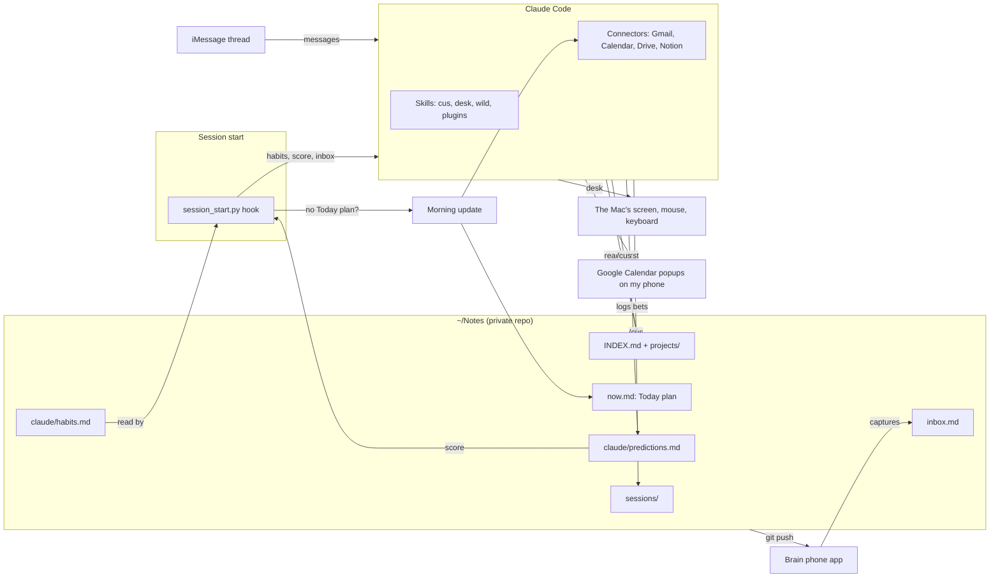

# How I use Claude Code

I'm a third-year Computing student. Claude Code runs most of my day: school, internship applications, a club
website, side projects. This repo is the setup behind that. It has the loop I run every day, the skills I wrote and
the plugins I lean on. My notes stay private; the parts anyone can reuse are here.

## The daily loop

1. **Morning update.** The first session each day starts with a hook that checks whether today's plan exists. If
   it doesn't, Claude does that before anything else. It files my phone captures, re-checks open items (did the
   deploy go live, did anyone reply, did a due date pass), reads my calendars and the next three days of
   deadlines, and writes a `## Today` plan into my notes.
2. **Work.** Claude reads my notes before touching a project, so it never starts cold.
3. **`/cus` (close up shop).** At the end, Claude writes the session back: a session note, updated project pages,
   new reminders, then a commit and push.

The notes and the hook live in [Brain](https://github.com/zacfink/brain), a plain-markdown "digital brain" with a
local app and a phone app on top.

## How the pieces connect

- **What starts things:** the session-start hook (every session), me (in the terminal or over iMessage), and the
  Brain phone app (captures, and optionally background agents).
- **What holds state:** only `~/Notes`. Claude Code sessions are disposable, and the notes are not.
- **How I'm reached away from my desk:** Google Calendar popups, never terminal notifications.

## Habits and calibration

Claude follows a list of habits I switch on and off in Brain. Each one exists because something went wrong
without it. All of them, with the reason behind each: [HABITS.md](HABITS.md).

Claude also logs predictions about what I mean, with a confidence, and scores them once I answer. Every session
starts with that score and what the misses say. Mine currently says its guesses about what I mean are often
wrong, so it asks before acting on one, and it claims more confidence than it earns, so it checks more.

## Skills I wrote

| Skill | What it does |
|---|---|
| [`cus`](skills/cus/SKILL.md) | End-of-session write-back into the notes, then commit and push. |
| [`desk`](skills/desk/SKILL.md) | Lets Claude see the screen and drive the mouse and keyboard when there's no API, using [screen-intelligence](https://github.com/zacfink/screen-intelligence). Asks before anything that submits, sends, buys or deletes. Logins and captchas go back to me. |
| [`wild`](skills/wild/SKILL.md) | The opt-in exception to "argue first": 40+ ideas across set lenses, then mutations, then a landing. |
| [`brain-polish`](skills/brain-polish/SKILL.md) | Finds UI in Brain that drifted from its own design rules and fixes it on a branch. Never redesigns. |

To set any of this up yourself, follow [SETUP.md](SETUP.md).

## Plugins and skills I use

| | Why |
|---|---|
| [Superpowers](https://github.com/obra/superpowers) | Process: brainstorm before building, debug systematically, write plans, verify before claiming done. |
| [Ponytail](https://github.com/DietrichGebert/ponytail) | Keeps code small. Stdlib before dependencies, one line before fifty. |
| [Impeccable](https://github.com/pbakaus/impeccable) | Frontend design and polish passes. |
| [gstack](https://github.com/garrytan/gstack) | A browser and a set of workflow skills. |
| [TypeSafe](https://github.com/typesafe-ai/skills) | Typed AI judgments as building blocks inside apps. |
| graphify | Turns my notes into a knowledge graph that Brain draws as a map. |
| iMessage ([official](https://github.com/anthropics/claude-plugins-official)) | Run Claude from a text thread when I'm away from my desk. |
| clangd and Swift LSPs ([official](https://github.com/anthropics/claude-plugins-official)) | Code intelligence for C and Swift. |

Connectors: Gmail, Google Calendar, Google Drive and Notion. Claude reads them, but anything outward (an email,
an invite, a post) needs my OK first.

## Not in here

My notes, memory, `settings.json`, permission rules, contacts and calendars. They're personal, and the permission
rules amount to a map of how to drive my machine.
